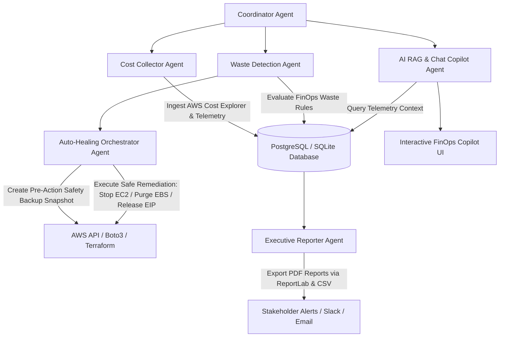

# ⚡ CloudWise AI — AI-Powered Cloud Cost Optimization & Auto-Healing Platform

An enterprise-grade **Multi-Agent FinOps & Automated Infrastructure Remediation Platform** that continuously audits multi-cloud telemetry, identifies idle & orphaned resource waste, generates actionable AI explanations, executes safe 1-click auto-healing remediations with pre-deletion backup snapshots, and delivers real-time reactive analytics on a modern dark-mode dashboard.

---

## 🏗️ Multi-Agent Architecture

CloudWise AI utilizes a multi-agent cooperative architecture to automate cost tracking, analyze waste, explain saving opportunities, orchestrate auto-healing remediations, and alert stakeholders:



---

## 🌟 Key Features

### 1. 🔍 Real-Time AWS Resource & Spend Ingestion
- **AWS Cost Explorer (`ce:GetCostAndUsage`)**: Daily cost tracking aggregated by service (EC2, RDS, S3, VPC, Lambda).
- **AWS EC2 & CloudWatch Metrics**: 7-day average CPU telemetry (`AWS/EC2:CPUUtilization`) to identify severely underutilized instances (< 5% CPU).
- **AWS EBS Volumes**: Detects orphaned, detached block storage volumes in `available` state.
- **AWS Elastic IPs**: Discovers unassociated public IPv4 allocations incurring hourly idle penalties.
- **AWS RDS Databases**: Audits idle database instances with 0 active client connections.
- **AWS S3 Buckets**: Analyzes storage buckets and missing lifecycle transition rules.
- **Zero-Config Simulation Fallback**: Gracefully operates in high-fidelity simulation mode when live credentials are not supplied.

### 2. 🤖 FinOps Waste Detection & Recommendation Engine
- Continuous heuristic scanning engine calculating **exact projected monthly & annual savings**.
- Generates transparent risk assessments (`low`, `medium`, `high`) and AI confidence scores.
- Contextual explanations highlighting why each resource is flagged as waste.

### 3. 🛡️ 1-Click Auto-Healing with Safety Guardrails
- **Pre-Deletion Backup Snapshots**: Captures point-in-time EBS snapshots before purging orphaned storage to prevent accidental data loss.
- **Automated Actions**:
  - `stop_instance`: Stops idle EC2 instances while preserving disk state.
  - `delete_volume`: Purges detached EBS storage after safety snapshot verification.
  - `release_eip`: Releases unassociated Elastic IPs back to the AWS pool.
  - `resize_instance`: Downscales oversized compute tiers (e.g., `m5.2xlarge` $\rightarrow$ `t3.medium`).
- Comprehensive audit trails and execution status logs.

### 4. 💬 FinOps AI Copilot (RAG-Powered)
- Interactive floating chat drawer with instant cost analytics support.
- Natural language query processing: *"Where is my cloud waste?"*, *"Which EC2 instance costs the most?"*, or *"Summarize optimization savings"*.
- Fallback support for Local Ollama, Google Gemini API, and rule-based FinOps explainers.

### 5. 📑 Executive PDF & CSV Reporting
- 1-click executive PDF report generation formatted with ReportLab (cost breakdown tables, graphs, remediation summaries).
- Granular CSV inventory export for FinOps auditing.

---

## 🛠️ Technology Stack

| Layer | Technologies |
| :--- | :--- |
| **Frontend** | React 18, TypeScript, Vite, Tailwind CSS, Recharts, Lucide Icons |
| **Backend** | FastAPI (Python 3.11+), Pydantic v2, SQLAlchemy, Boto3 |
| **Database** | SQLite (Default Dev) / PostgreSQL (Production) |
| **AI / NLP** | RAG Engine, ChromaDB / SQLite Vector, Ollama / Gemini API |
| **DevOps & IaC**| Docker Compose, Terraform (AWS Landing Zone), Kubernetes Manifests, Prometheus & Grafana |

---

## 🚀 Quick Start & Local Execution

### Prerequisites
- Python 3.11+
- Node.js 18+ & npm
- AWS IAM Credentials (Optional — Simulation mode works out-of-the-box)

---

### Step 1: Start Backend API

```powershell
# Navigate to backend directory
cd backend

# Create & activate Python virtual environment
python -m venv venv
.\venv\Scripts\Activate.ps1   # On Linux/macOS: source venv/bin/activate

# Install dependencies
pip install -r requirements.txt

# Start FastAPI server
uvicorn app.main:app --host 127.0.0.1 --port 8000 --reload
```
* **Swagger API Documentation:** [http://127.0.0.1:8000/docs](http://127.0.0.1:8000/docs)
* **Health Check:** [http://127.0.0.1:8000/health](http://127.0.0.1:8000/health)

---

### Step 2: Start Frontend Dashboard

Open a second terminal:
```powershell
# Navigate to frontend directory
cd frontend

# Install Node dependencies
npm install

# Start Vite dev server
npm run dev
```
* **Interactive Dashboard:** [http://localhost:3000](http://localhost:3000) (or `http://localhost:3001`)

---

## 🔐 Environment Configuration

Create a `.env` file in the `backend/` directory (refer to `backend/.env.example`):

```env
PROJECT_NAME=CloudWise AI
ENVIRONMENT=development
DEMO_MODE=false
DATABASE_URL=sqlite:///./cloudwise.db

# AWS Integration (Optional: Leave blank to use Simulation Mode)
AWS_ACCESS_KEY_ID=
AWS_SECRET_ACCESS_KEY=
AWS_DEFAULT_REGION=us-east-1

# AI Settings
AI_PROVIDER=local
```

> **Security Note:** `.env` is strictly excluded in `.gitignore` to prevent leaking cloud credentials.

---

## 📡 REST API Endpoints Overview

| Method | Endpoint | Description |
| :--- | :--- | :--- |
| `GET` | `/health` | Kubernetes readiness & liveness probe |
| `GET` | `/api/costs/summary` | 30-day spend summary, trends, and category breakdown |
| `GET` | `/api/costs/explorer` | Multi-cloud resource inventory with search & filter |
| `GET` | `/api/optimizations/` | Active waste recommendations with AI explanations |
| `POST` | `/api/optimizations/scan` | Trigger manual infrastructure waste scan |
| `POST` | `/api/optimizations/{id}/remediate` | Execute live Auto-Healing remediation with safety backup |
| `GET` | `/api/aws/status` | AWS connection health, active account, and monitored counts |
| `POST` | `/api/aws/credentials` | Update and test AWS IAM credentials in real-time |
| `POST` | `/api/chat/` | Query FinOps AI Copilot |
| `GET` | `/api/reports/pdf` | Download executive PDF cost optimization report |
| `GET` | `/api/reports/csv` | Download CSV resource inventory report |

---

## 📄 License

This project is licensed under the MIT License.
